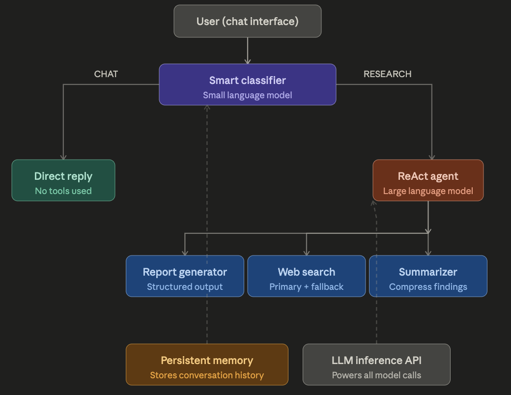

# 🔬 AI Research Assistant

An intelligent research agent that searches the web, summarizes findings, and generates structured reports — powered by Groq, LangChain, and Tavily.

## Features
- 🔍 Smart web search with Tavily + DuckDuckGo fallback
- 🧠 ReAct agent loop with reasoning steps
- 📝 Structured markdown report generation
- 💬 Casual chat mode — only researches when needed
- 🗄️ Persistent conversation memory via SQLite

## Tech Stack
- **LLM**: Groq (Llama 3.1 8B)
- **Framework**: LangChain
- **Search**: Tavily API + DuckDuckGo
- **UI**: Streamlit
- **Memory**: SQLite + SQLAlchemy

## Setup
```bash
git clone https://github.com/YOUR_USERNAME/ai-research-agent
cd ai-research-agent
python -m venv venv
source venv/bin/activate
pip install -r requirements.txt
```

Add your API keys to `.env`:

## Architecture
